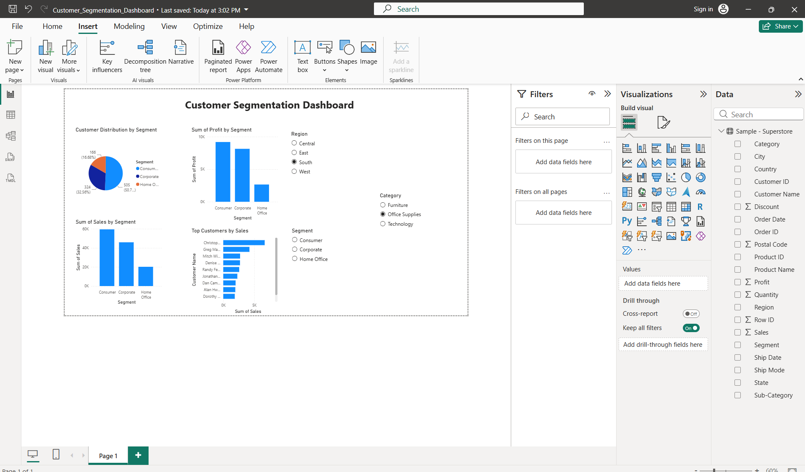

# Customer Segmentation Dashboard

## Project Overview

This Power BI dashboard segments customers based on purchasing behavior and business segments. The dashboard helps analyze customer groups, sales contribution, profitability, and top customers.

## Features

* Customer Distribution by Segment
* Sales by Segment
* Profit by Segment
* Top Customers by Sales
* Interactive Filters (Region, Category, Segment)

## Tools Used

* Power BI Desktop
* Superstore Dataset

## Dashboard Preview

## Dashboard Preview

## Outcome

The dashboard provides customer insights that help businesses understand purchasing patterns, identify valuable customer segments, and support data-driven decision-making.
